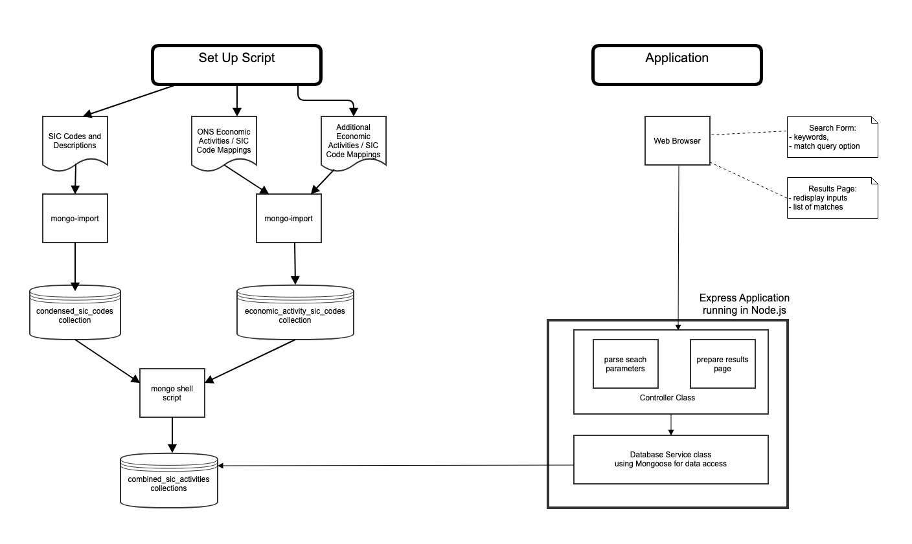

# SIC Code Finder Prototype

## Overview

This web app allows you to enter keywords for a SIC code lookup based on the economic activities that make up a SIC Code. A SIC Code is an abbreviation of "Standard industrial classification of economic activities"

This Node.js application is based on the [Node Web Starter](https://github.com/companieshouse/node-web-starter) template and uses:

- [Express](https://expressjs.com),
- [TypeScript](https://typescriptlang.org),
- Add MongoDB
- [GovUK Frontend](https://github.com/alphagov/govuk-frontend).

## Contents

- [SIC Code Finder Prototype](#sic-code-finder-prototype)
  - [Overview](#overview)
  - [Contents](#contents)
    - [Quick start](#quick-start)
    - [Environment Variables](#environment-variables)
    - [Datafiles](#datafiles)
    - [Prerequisites](#prerequisites)
    - [Running the server](#running-the-server)
    - [Static assets](#static-assets)
    - [Compiling the application](#compiling-the-application)
    - [Linting](#linting)

### Quick start

Populate the database:

1. Run docker with a Mongo container running (making sure that you have the correct setting for the environmental variable MONGO_DOCKER_NAME)
2. Run the script `./scripts/refresh-mongo-db.sh`

Install the dependencies:

  `make init`

And then start the application:

  `npm start` or  `npm run dev` (uses `nodemon`)

Then go to [http://localhost:3000](http://localhost:3000).

### Environment Variables

The following is a list of environment variables for the service to run:

Name                                        | Description                                                            | Example Value
------------------------------------------- | ---------------------------------------------------------------------- | ------------------------
SIC_CODE_MONGO_URL                          | Base URL of the Mongo Database                                         | `mongodb://chs.local:27017`
SIC_CODE_DATABASE                           | Mongo Database name                                                    | `sic_code`
SIC_CODE_WEB_PORT                           | Application port number                                                | 3000 (default)

The following is a list of environmental variables required to load the database

Name                                        | Description                                                            | Example Value
------------------------------------------- | ---------------------------------------------------------------------- | ------------------------
MONGO_DOCKER_NAME                           | Name of the MongoDB Docker container                                   | docker-mongo_1
SIC_CODE_DATABASE                           | Mongo Database name                                                    | sic_code

### Datafiles

These are `csv` files in the `./datafiles` and can be loaded into MongoDB. Examples below use Mongo running in a docker container.

### Prerequisites

You are going to need a few things to begin. Firstly, NodeJS. There are a few ways to install it.

- [Official installer](https://nodejs.org/en/)
- [Node Version Manager](https://github.com/nvm-sh/nvm)
- [Homebrew](https://formulae.brew.sh/formula/node)

Node version manager allows you to install multiple versions side by side on the host machine.

Once you have that installed, you will need to install the dependencies (locally) and [GulpJS](https://gulpjs.com) (globally). This task runner is used to compile the [Sass](https://sass-lang.com) used in the GovUK Frontend.

    npm i
    npm install gulp-cli -g

### Running the server

There are two ways to run the server in development. You run it in normal mode;

  `npm start`

Update following (get `nodemon` working)

Or, automatically reload the server once you make changes to source code (this uses `nodemon`);

  `npm run dev`

### Static assets

Sass is used to compile the css from GovUK Frontend. The `static` gulp task will build the necessary files and output them to the [`dist`](./dist) folder.

  `gulp static`

During development, static assets are served from this folder using the url prefix `/static`.

### Compiling the application

TypeScript compiles down the JavaScript code that eventually gets run via NodeJS. The `build` npm task will write the JavaScript to the [`dist`](./dist) folder.

  `npm run build`

**It is this code that gets run in production.**

### Linting

[TSLint](https://palantir.github.io/tslint/) is used to perform static analysis on code style.

  `npm run lint`
